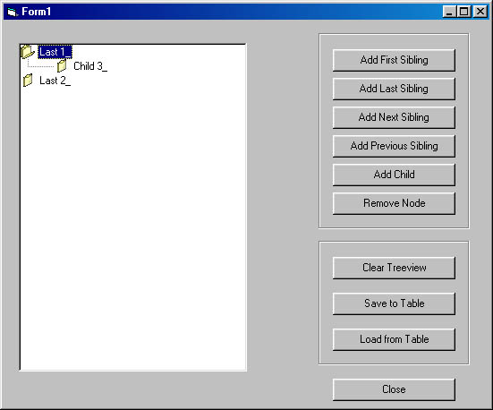



## TreeView

### Description

An excellent example of how to use TreeView from Microsoft. Add, Remove, Rename, nodes, Etc
 
### More Info
 

             |
---                |---
**Submitted On**   |2001-11-07 11:04:36
**By**             |[Chad Gutowsky](https://github.com/Planet-Source-Code/PSCIndex/blob/master/ByAuthor/chad-gutowsky.md)
**Level**          |Beginner
**User Rating**    |4.5 (18 globes from 4 users)
**Compatibility**  |VB 6\.0
**Category**       |[Coding Standards](https://github.com/Planet-Source-Code/PSCIndex/blob/master/ByCategory/coding-standards__1-43.md)
**World**          |[Visual Basic](https://github.com/Planet-Source-Code/PSCIndex/blob/master/ByWorld/visual-basic.md)
**Archive File**   |[TreeView337411172001\.zip](https://github.com/Planet-Source-Code/chad-gutowsky-treeview__1-28727/archive/master.zip)

